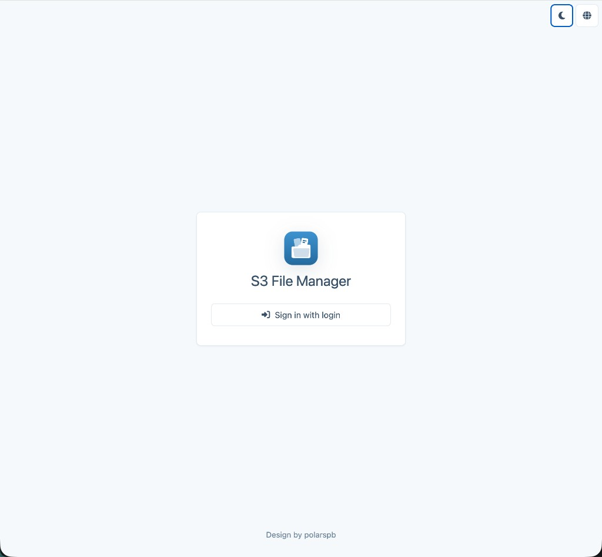
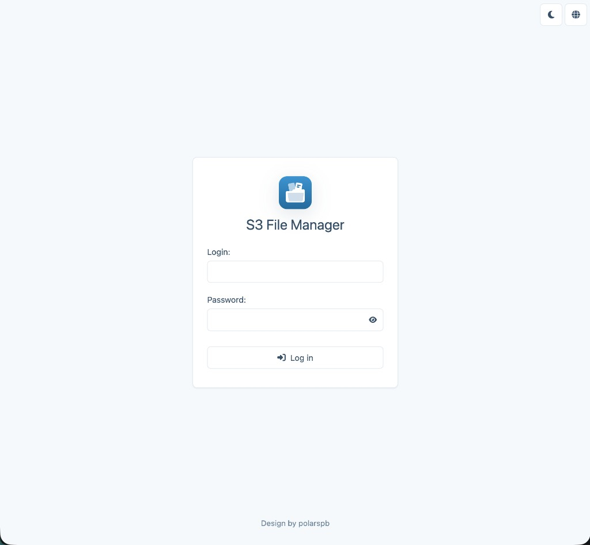
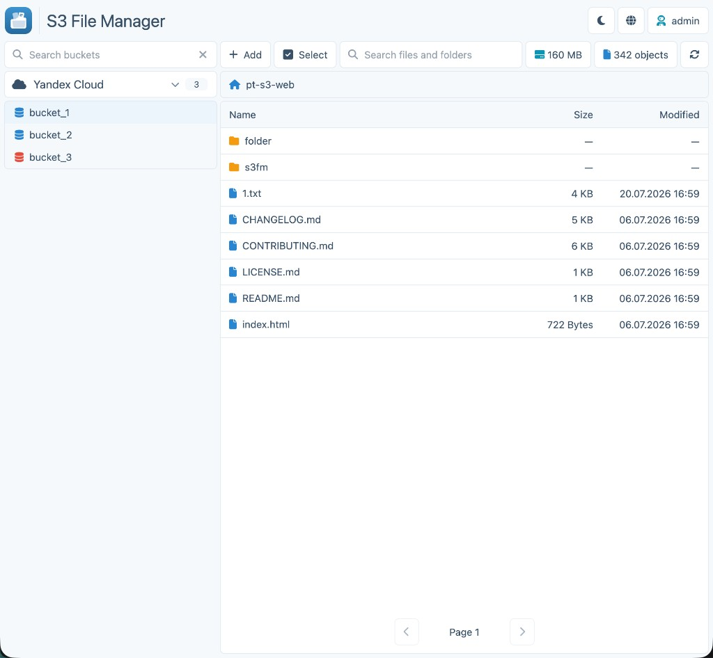
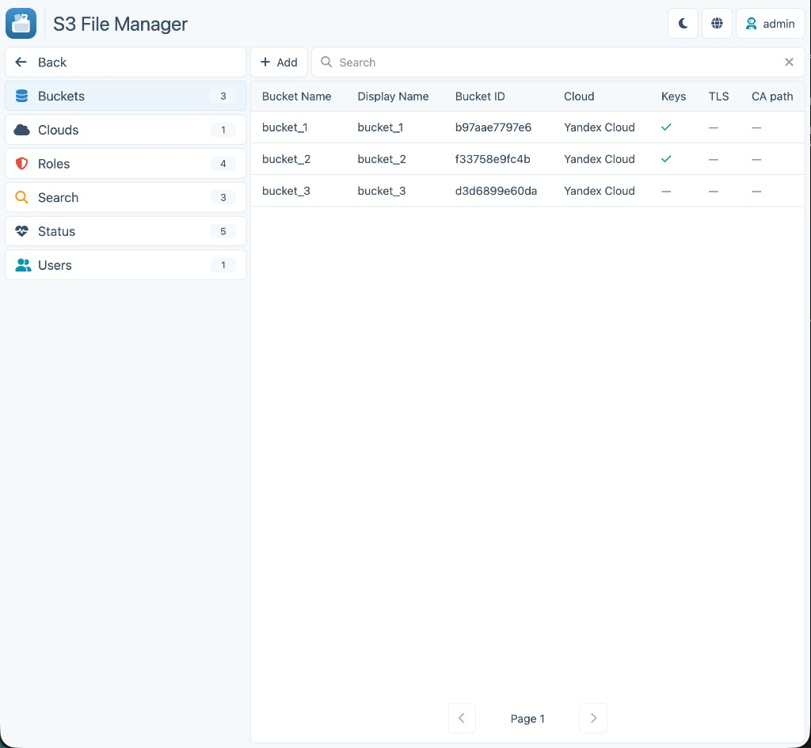

# S3 File Manager

Веб-сервис для работы с S3-совместимыми хранилищами:
- просмотр и поиск файлов/папок в бакетах;
- загрузка и создание (кнопка **+** в тулбаре и drag-and-drop), предпросмотр (изображения, PDF, JSON/TXT/MD/HTML/CSS), скачивание, удаление объектов;
- массовые операции (в рамках прав роли);
- админ-панель для управления бакетами, облаками, пользователями и ролями;
- разграничение доступа по облакам и конкретным бакетам.

Сервис хранит конфигурацию и ACL в PostgreSQL и отдаёт единый веб-интерфейс на Flask.

## Скриншоты

<p align="center">
  
  
</p>
<p align="center">
  
  
</p>

## Быстрый старт (Docker Compose)

```bash
docker compose up --build
```

- UI: [http://localhost:3000](http://localhost:3000)
- логин: `admin` / `admin`

Подробности: [Docker](docs/docker.md).

## Документация

| Раздел | Описание |
|---|---|
| [Архитектура](docs/architecture.md) | Стек, структура репозитория, модель данных |
| [Авторизация и ACL](docs/auth.md) | SSO (OIDC), LDAP lookup, роли и permissions |
| [API](docs/api.md) | Health, auth, файлы, поиск, settings |
| [Веб-интерфейс](docs/ui.md) | Загрузка, предпросмотр, массовые операции, settings |
| [Конфигурация](docs/configuration.md) | Переменные окружения и логирование |
| [Запуск локально](docs/local-run.md) | Python venv, PostgreSQL, опциональный Meilisearch |
| [Docker](docs/docker.md) | Docker Compose и образ web |
| [Эксплуатация](docs/operations.md) | Экспорт/импорт конфига, лимит загрузки, заметки |

Стандартизация разработки: [`src/config.md`](src/config.md).
